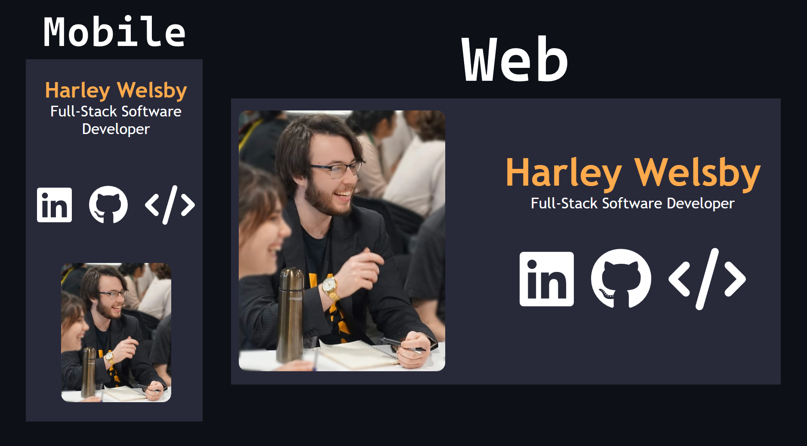

# Old Portfolio Site with Next.js

My old website, built with the Next.js framework for React and hosted serverlessly on Vercel.

## Notable Packages Used:

- Icons from <a href="https://fontawesome.com/">FontAwesome</a>
- Bouncy Animation on page load from <a href="https://animate.style/">Animate.css</a>
